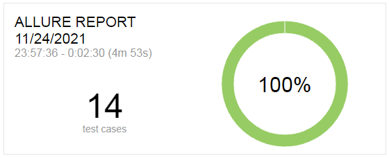

## Diploma Project for QA Automation course
 *using Onliner.by  -   https://www.onliner.by/  

---
### TECHNOLOGY

Below you can see technology / framework used in this project. 

> * Technology: Java, TestNG, Selenium, Maven
> * Framework: Page Object Model , Selenide, Allure, RestAssured
---

### INSTALLATION

Please make sure the release file is unpacked under  a Web-accessible directory. You will see the following files and directories:

> * src/main  - including all the test logic and additional files
> * src/test - including test classes
> * pom.xml - describing project configuration
> * README.md - this file

---
### DRIVER IMPLEMENTATION

Please check BaseTestSelenide.java class where the Driver starts.
The following class sets driver configuration options, use Selenide method Open()  to start your browser and open URL you provided.
All test classes where the driver is needed extend BaseTest class to get driver running.
---
### QUICK START 

You can use TestNG library for running tests on your local machine.
Choose the directory of the necessary test class and run it.

>
---
### API DOCUMENTATION

This project includes API tests for Onliner.by.
Test methods make calls to a server and data is receiving back over the HTTP protocol.
Below you can find links which contain public API documentation for Onliner.by.
>https://github.com/onlinerby/onliner-cart-api
> 
> https://github.com/onlinerby/onliner-second-api
> 
> https://github.com/onlinerby/onliner-b2b-api
### REPORTING
You can also get the full test runs statistics using Allure Framework.
Use the following commands in terminal and check the link you receive.
* allure generate 
* allure open 

>The example of Allure Report:
>
>

---
### WHAT'S NEXT 
Please check the TeachMeSkills website to discover more IT courses and choose the one you like.

[_https://teachmeskills.by/_](https://teachmeskills.by/)